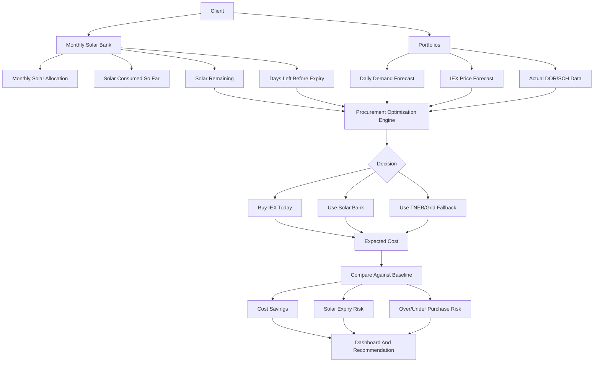

# Power Procurement Strategy And Goal

## Purpose

The goal of the Power Trading application is to help each client reduce electricity cost by choosing the best daily mix of:

- Solar power
- IEX power
- TNEB/Grid power

The application should not simply use solar first. It should decide when to use solar and when to buy IEX based on cost, remaining solar balance, expiry risk, demand forecast, and expected future IEX price.

## Cost Order

```text
Solar < IEX < TNEB/Grid
```

Solar is normally the cheapest source, IEX is usually cheaper than TNEB, and TNEB/Grid is the costly fallback.

But solar has one special rule: unused solar expires at month end. So the best strategy depends on both today's price and the remaining days in the month.

## Source Validity

```text
Solar
- Available as a monthly bank/allocation for the client
- Common across the client's portfolios
- Can be consumed later in the month
- Expires if unused by month end

IEX
- Bought for a specific day/market
- Must be consumed within that day
- Should be bought when today's price is attractive

TNEB/Grid
- Costly fallback source
- Used only when solar and IEX planning cannot cover demand
```

## Strategic Rule

```text
If IEX is cheap today:
  Buy IEX first and preserve solar for later days.

If IEX is expensive today:
  Use solar and avoid unnecessary IEX purchase.

If month-end is near and solar balance is high:
  Consume solar aggressively before it expires.

If both solar and IEX are insufficient:
  Use TNEB/Grid as fallback.
```

## Main Decision Question

For each client, portfolio, and day:

```text
How much power should we buy from IEX today,
how much solar should we consume today,
and how much TNEB/Grid exposure will remain?
```

This decision depends on:

- Forecast demand for the next day
- Forecast IEX price for the next day
- Remaining monthly solar balance
- Remaining days before solar expiry
- Expected future IEX prices
- TNEB/Grid tariff
- Portfolio-level consumption pattern

## High-Level Flow



## Optimization Logic

```text
Inputs:
  - Tomorrow expected consumption
  - Tomorrow expected IEX price
  - Remaining solar bank
  - Days left in month
  - TNEB/Grid price
  - Historical DOR/SCH actuals

Engine:
  - Estimate demand by time block
  - Estimate IEX market opportunity
  - Estimate solar expiry pressure
  - Compare today's IEX price against expected future IEX price
  - Recommend source mix

Output:
  - Buy X units from IEX
  - Use Y units from solar
  - Expected TNEB/Grid fallback Z units
  - Expected cost
  - Expected savings
  - Risk warning
```

## Example Decisions

### Case 1: Cheap IEX, Many Days Left

```text
Today IEX price: low
Solar remaining: high
Days left: many

Recommendation:
Buy IEX today and preserve solar for later.
```

### Case 2: Expensive IEX, Solar Available

```text
Today IEX price: high
Solar remaining: enough
Days left: many

Recommendation:
Use solar today and avoid expensive IEX.
```

### Case 3: Month-End Solar Expiry Risk

```text
Today IEX price: moderate
Solar remaining: high
Days left: very few

Recommendation:
Use solar aggressively before expiry.
```

## Application Phases

```text
Phase 1: Data Foundation
  Upload DOR/SCH files and store transaction-level data.

Phase 2: Cost Analysis
  Compare Solar, IEX, and TNEB/Grid usage and savings.

Phase 3: Planning Engine
  Recommend the daily source mix and IEX purchase quantity.

Phase 4: AI Forecasting
  Predict next-day demand and IEX price to improve trading decisions.
```

## Final Product Goal

```text
The application should become a procurement optimization system.

It should help the client:
  - Avoid costly TNEB/Grid power
  - Buy IEX when the price is favorable
  - Preserve solar when future value may be higher
  - Consume solar before month-end expiry
  - Improve daily trading decisions using forecasts
```
